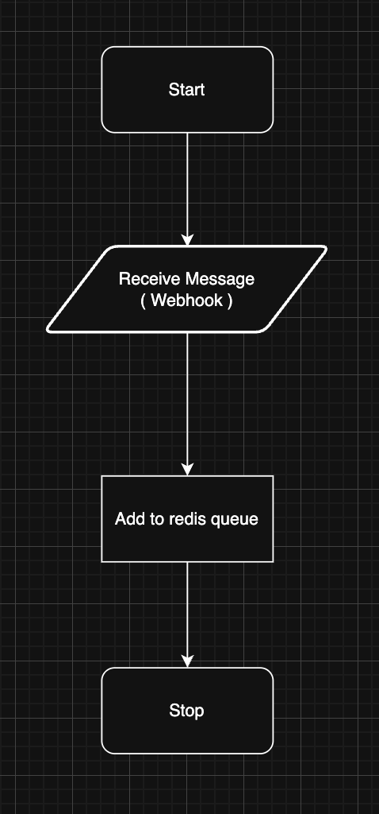
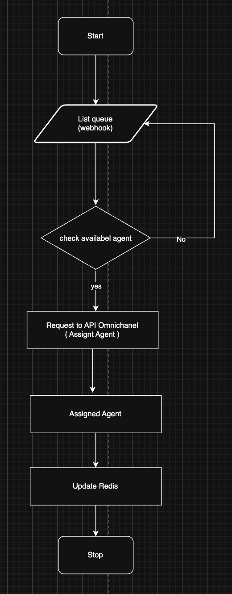
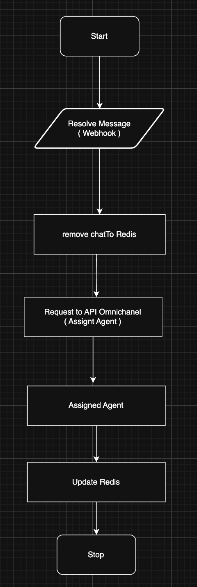
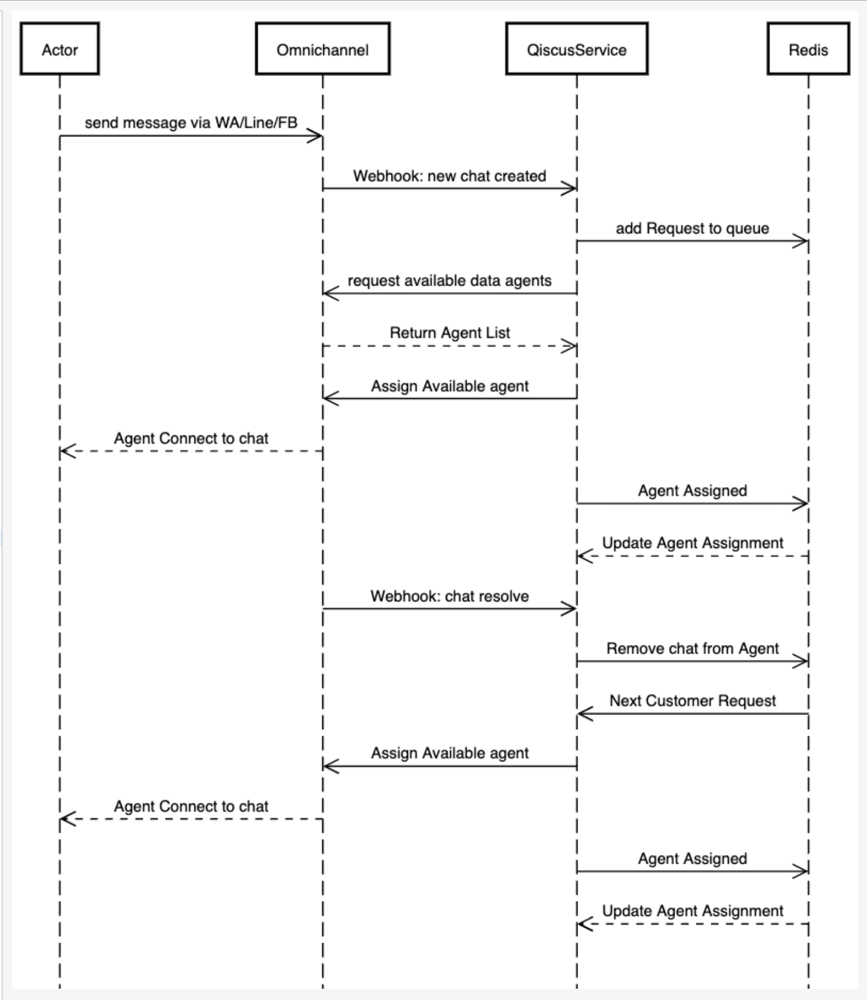

# omnichannel-qiscus

<!-- PROJECT LOGO -->
<br />
<div align="center">
  <h3 align="center">Qiscus Custom Agent Allocation</h3>

  <p align="center">
    Custom chat allocation to agent for qiscus service
    <br />
</p>
</div>

<!-- ABOUT THE PROJECT -->

## About The Project

This is a service to allocate chat to the agent available, eliminating the process of manual assigning to the agent

Currently it can only provide the same amount of max customer of all agent. It can be modified from redis and the default amount of it in the env file

### Built With

1. Golang - Handle most of the process
2. Redis - Queue system of the webhook
3. Docker - Providing self hosted Redis database

<p align="right">(<a href="#readme-top">back to top</a>)</p>

<!-- GETTING STARTED -->

## Getting Started

How to setup the service

### Prerequisites

- Golang  
  Can be installed from this link https://go.dev/doc/install
- Docker
  Can refer to this link https://docs.docker.com/get-started/get-docker/

### Installation

1. Clone the repo
   ```sh
   git clone https://github.com/1234iqbal/omnichannel-qiscus
   ```
2. Install go packages
   ```sh
   go mod tidy
   ```
3. Copy .env.example to `.env`
   ```sh
   cp .env.example .env
   ```
4. Run the redis database using docker or make command
   ```sh
   docker compose up -d
   ```
   or
   ```sh
   make up
   ```

<!-- USAGE EXAMPLES -->

## How It Works?

### Flow Chart
1. WebHook Incomeing.



2. Worker



3. Webhook Resolve



### Sequence Diagram
This is the sequence diagram of how the general process happens continously


## Contact

Fatkhul Jabal Abdul Kholiq - mifjak1@gmail.com - [Whatsapp](wa.me/+6282134060591)